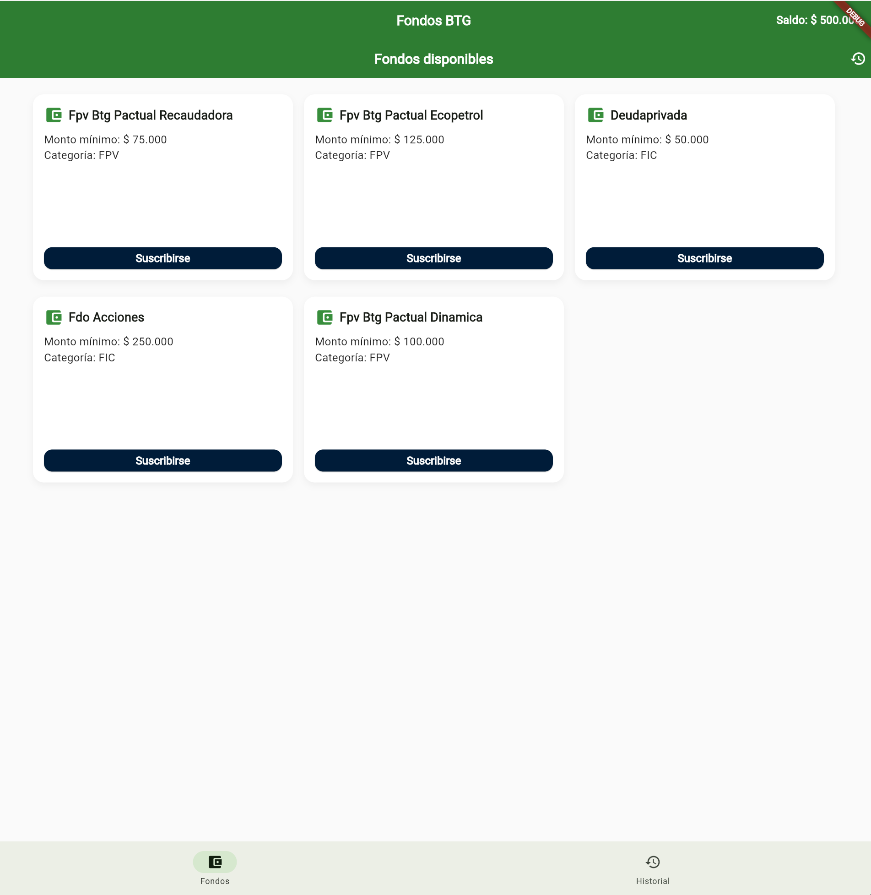
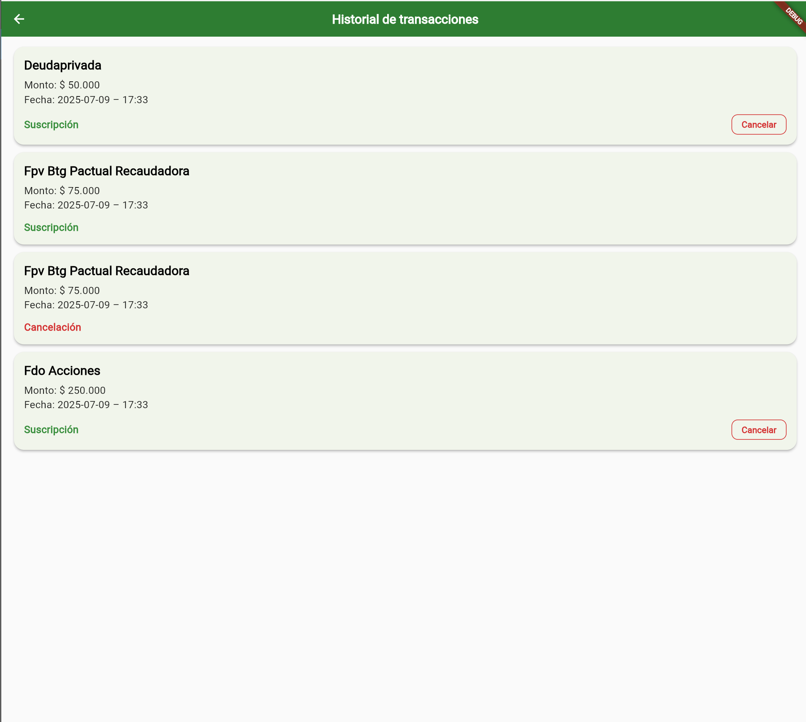

# 📱 BTG Funds App

Una aplicación Flutter para gestionar fondos de inversión, permitiendo a los usuarios visualizar, suscribirse y cancelar suscripciones de forma intuitiva.

---

## 🚀 Funcionalidades

- ✅ Visualización de fondos disponibles (modo responsive)
- ✅ Suscripción a un fondo (con validación de saldo y método de notificación)
- ✅ Cancelación de suscripciones
- ✅ Historial de transacciones (suscripciones y cancelaciones)
- ✅ Persistencia del estado con [Riverpod](https://riverpod.dev)
- ✅ Pruebas automatizadas de widgets

---

## 📦 Estructura del proyecto

```
lib/
├── core/                  # Modelos y utilidades base
│   ├── models/
│   └── extensions/
├── data/
│   └── mocks/             # Datos simulados
├── presentation/
│   ├── providers/         # Providers de estado
│   ├── screens/           # Pantallas principales
│   └── widgets/           # Componentes reutilizables
├── utils/                 # Utilidades (responsive, formateo)
├── app.dart               # Root de la app (MyApp)
└── main.dart              # Entry point
```

---

## 🧪 Testing

El proyecto cuenta con tests automatizados:

- `fondo_card_test.dart`: Verifica que el card del fondo muestra los datos correctos.
- `fondos_screen_test.dart`: Valida el flujo completo de suscripción.

### Ejecutar pruebas

```bash
flutter test
```

---

## 🛠️ Tecnologías

- **Flutter 3.13+**
- **Dart**
- **Riverpod** – Para manejo de estado
- **Intl** – Para formato de moneda y fecha
- **Material Design** – UI responsive
- **flutter_test** – Tests unitarios y de integración

---

## 📸 Capturas de pantalla (opcional)

Agrega aquí imágenes si deseas mostrar vistas del app:

  


---

## 💻 Instalación

1. Clona el repositorio:

```bash
git clone https://github.com/yrmedina9/btg_funds_app.git
cd btg_funds_app
```

2. Instala dependencias:

```bash
flutter pub get
```

3. Ejecuta la aplicación:

```bash
flutter run
```

---

## 📂 Pendiente o mejoras futuras

- 🔐 Autenticación de usuario
- ☁️ Persistencia en base de datos
- 📱 Publicación en tiendas (Android/iOS)
- 🔔 Notificaciones push

---

## 🧑‍💻 Autor

Yonathan Ramos Medina  
💼 Desarrollador Frontend & Flutter  
📧 [Tu correo o LinkedIn]

---

## 📝 Licencia

Este proyecto se encuentra bajo la licencia MIT.  
Puedes usarlo, modificarlo y distribuirlo libremente.
